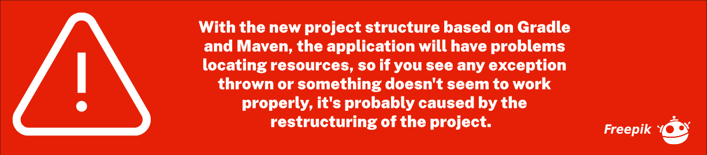

### HALE

Hale is a turn based RPG with deep tactical combat and character customization.
Included is a lengthy and varied campaign with many quests, items and monsters,
visiting a variety of locales. The entire system is built to be moddable from
the ground up.

### Newsletter

    

#### Screenshots

#### See Wiki

[Wiki][Wiki-Home]

#### Compiling from Source

###### Requerimients

- Gradle 6.1

###### Commands

To run Gradle from the command line you must first have installed Gradle correctly. 
When installed correctly you can run Gradle using this command line:

    gradle run

#### Project Original

Link to page: [Sourceforge][Sourceforge-Home]

#### License

This game is distributed under the terms of the GPL.
See License.md for details.

[Sourceforge-Home]: https://sourceforge.net/p/hale/wiki/Home/
[Wiki-Home]: https://github.com/Andres6936/HALE/wiki/Quickstart-Guide
